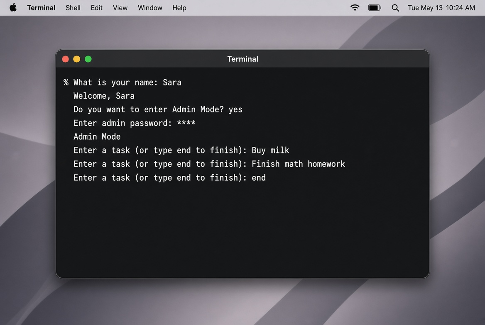
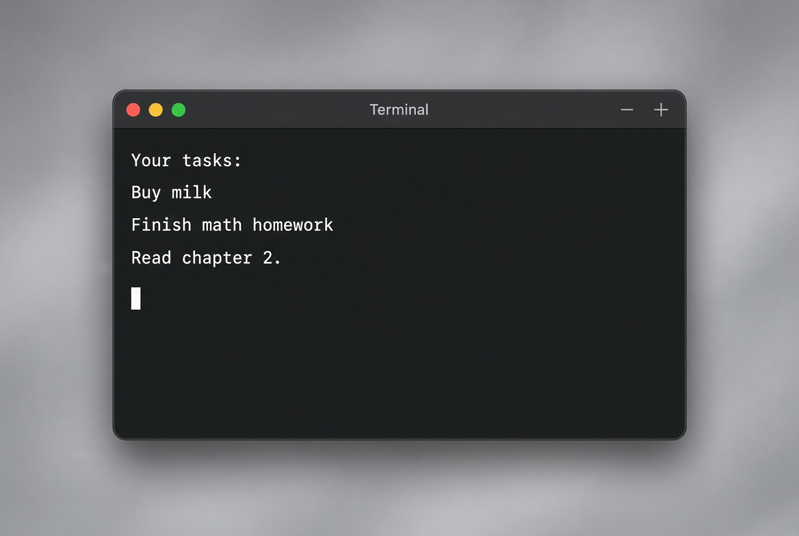
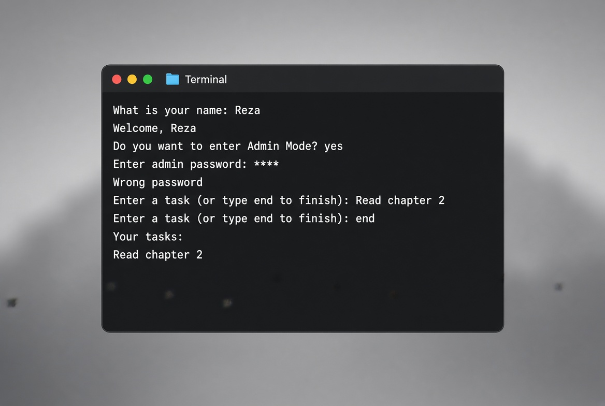

# Personal Task Manager

A Python command-line app for writing down personal tasks. The user enters a name, optionally unlocks Admin Mode, adds tasks until they type `end`, then sees the list in the terminal and in `tasks.txt`.

Repository: [ehsan-fath133/personal_task_manager2](https://github.com/ehsan-fath133/personal_task_manager2)

## Description

The app runs in the terminal. It greets the user, checks an admin password from `.env` when asked, collects tasks, saves them, and prints them. Task helpers are in `task.py`. The entry point is `main.py`.

## Table of Contents

- [Description](#description)
- [Features](#features)
- [Project Structure](#project-structure)
- [File Description](#file-description)
- [Requirements](#requirements)
- [Installation](#installation)
- [Environment Setup](#environment-setup)
- [Usage](#usage)
- [Example Output](#example-output)
- [Screenshot](#screenshot)
- [Demo](#demo)
- [Roadmap](#roadmap)
- [Contributing](#contributing)
- [License](#license)
- [Author](#author)

## Features

- Welcome message with the user's name
- Admin Mode with a password from `.env`
- Add tasks until the user types `end`
- Print the task list
- Save tasks to `tasks.txt`
- Keep `.env` and `tasks.txt` out of Git

## Project Structure

```text
personal_task_manager2/
├── .env.example
├── .gitignore
├── main.py
├── task.py
├── requirements.txt
├── .env          created locally, not committed
└── tasks.txt     created after a run
```

## File Description

| File | Role |
| --- | --- |
| `main.py` | Loads `.env`, asks for the name and password, reads tasks, saves and prints them |
| `task.py` | `add_task` adds a task. `show_tasks` prints the list |
| `.env.example` | Template with `TASK_MANAGER_ADMIN_PASSWORD` |
| `.gitignore` | Ignores `tasks.txt`, `__pycache__`, `*.log`, and `*.env` |
| `requirements.txt` | Lists `python-dotenv` |
| `.env` | Real admin password. Do not commit |
| `tasks.txt` | Saved tasks. Each task is written with ` - ` after it |

`save_tasks(tasks)` writes the list to `tasks.txt`.

## Requirements

- Python 3.8 or newer
- pip and Git
- Windows, macOS, or Linux

Package: `python-dotenv`

## Installation

```bash
git clone https://github.com/ehsan-fath133/personal_task_manager2.git
cd personal_task_manager2
python -m venv .venv
```

Windows: `.venv\Scripts\activate`  
macOS and Linux: `source .venv/bin/activate`

```bash
pip install -r requirements.txt
```

`main.py` imports `tasks`, but the file is `task.py`. Rename `task.py` to `tasks.py`, or change the import to `from task import ...`. Also keep only one copy of the script in `main.py`, and make sure `save_tasks` is in the imported module.

## Environment Setup

`.env` is not in the repo. Create it from the example.

Windows: `copy .env.example .env`  
macOS and Linux: `cp .env.example .env`

```env
TASK_MANAGER_ADMIN_PASSWORD = mySecret123
```

`load_dotenv()` loads the file. `os.getenv("TASK_MANAGER_ADMIN_PASSWORD")` reads the password. A match prints `Admin Mode`. Do not commit `.env`.

## Usage

```bash
python main.py
```

1. Enter your name.
2. Type `yes` to open Admin Mode, or anything else to skip it.
3. If you typed `yes`, enter the password from `.env`.
4. Enter one task per line.
5. Type `end` to finish.

The list is saved to `tasks.txt` and printed in the terminal.

## Example Output

```text
What is your name: Sara
Welcome, Sara
Do you want to enter Admin Mode? yes
Enter admin password: mySecret123
Admin Mode
Enter a task (or type end to finish): Buy milk
Enter a task (or type end to finish): Finish math homework
Enter a task (or type end to finish): end
Your tasks:
Buy milk
Finish math homework
```

A wrong password prints `Wrong password`.

## Screenshot

Adding tasks in Admin Mode:



Printed task list:



Wrong admin password:



## Demo

```text
$ python main.py
What is your name: Sara
Welcome, Sara
Do you want to enter Admin Mode? yes
Enter admin password: mySecret123
Admin Mode
Enter a task (or type end to finish): Buy milk
Enter a task (or type end to finish): end
Your tasks:
Buy milk
```

There is no hosted demo. The app runs only in a local terminal. After a run, `tasks.txt` appears in the project folder.

## Roadmap

- Remove leftover copies inside `main.py`
- Match the import name with the module file
- Load old tasks at startup
- Edit, delete, and mark tasks done
- Add priority, due date, and tests

## Contributing

Fork the repo, create a branch, commit, push, and open a pull request. Do not commit `.env` or a personal `tasks.txt`.

## License

No license file yet. Until one is added, all rights stay with the author.

## Author

- Ehsan Fathabadi — [ehsan-fath133](https://github.com/ehsan-fath133)
- Contributor: [sainish](https://github.com/sainish)
